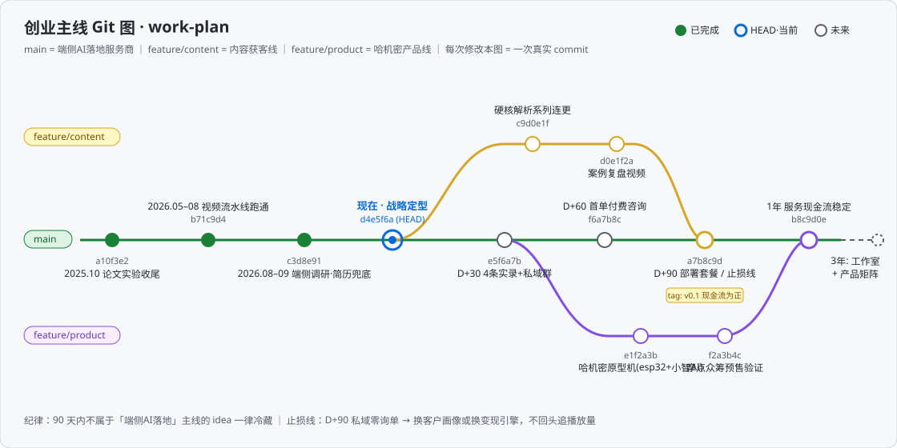

# work-plan

创业战略档案仓：决策 QA 日志 + Git 图路线图 + 创业指南。

## 目录

| 文件 | 说明 |
|---|---|
| [QA.md](./QA.md) | 与 AI 助手的关键战略问答档案（决策日志，持续维护） |
| [roadmap.svg](./roadmap.svg) | Git 提交节点风格的主线路线图（main + 两条 feature 分支） |
| [创业指南.md](./创业指南.md) | 现状盘点 → 战略定位 → 90 天计划 → 三年路线 → 风险清单 |

## 维护方式

- 每次战略讨论后，把新 QA 追加到 `QA.md` 并更新待办勾选状态
- 里程碑推进时更新 `roadmap.svg` 的节点状态（空心 → 实心 = 完成）
- 每次修改都是一次真实 commit，git log 即决策演变史
