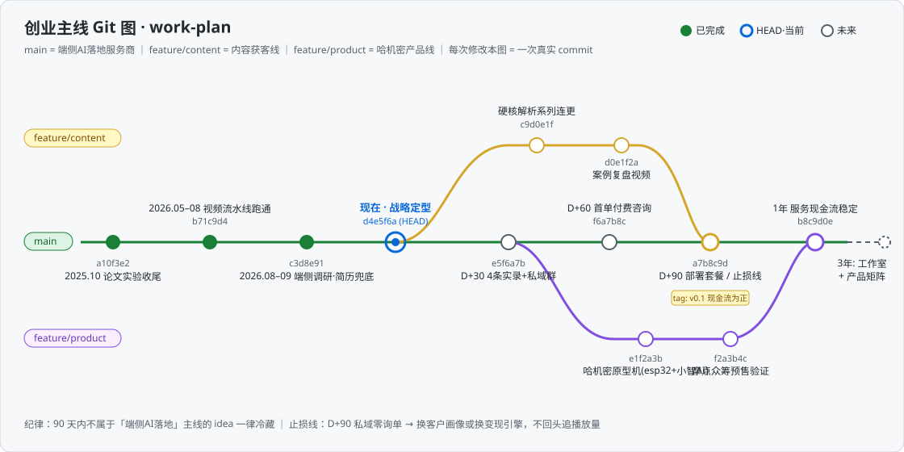

# work-plan

创业战略档案仓：决策 QA 日志（索引+细节分层） + Git 图路线图 + 创业指南。

## 目录

| 文件 | 说明 |
|---|---|
| [QA.md](./QA.md) | **索引层**：每轮 QA 一行标题+结论+链接，最新在最上，待办置顶 |
| [details/](./details/) | **细节层**：每轮 QA 的执行细节子文档（Q编号-主题.md），从索引点击跳转 |
| [roadmap.svg](./roadmap.svg) | Git 提交节点风格的主线路线图（main + 两条 feature 分支） |
| [创业指南.md](./创业指南.md) | 现状盘点 → 战略定位 → 90 天计划 → 三年路线 → 风险清单 |
| [哈机密第一季脚本.md](./哈机密第一季脚本.md) | 养宠叙事版 E01–E06 分镜脚本 |
| [哈机密第一季脚本_工程师叙事版.md](./哈机密第一季脚本_工程师叙事版.md) | 工程师叙事版 T01–T06 分镜脚本 |
| [调研_AI服务赚钱实操案例.md](./调研_AI服务赚钱实操案例.md) | 带数据来源与可信度标注的实操案例库 |

## 维护方式

- 每轮新 QA：先建 `details/Q编号-主题.md` 细节文档，再在 QA.md 索引顶部登记一行（标题+结论+链接）
- QA 标题必须带北京时间日期；待办追踪置顶；里程碑推进时更新 `roadmap.svg` 节点状态（空心→实心）
- 飞书同步：QA.md 整篇覆盖飞书「创业决策QA档案」，写入后读回校验
